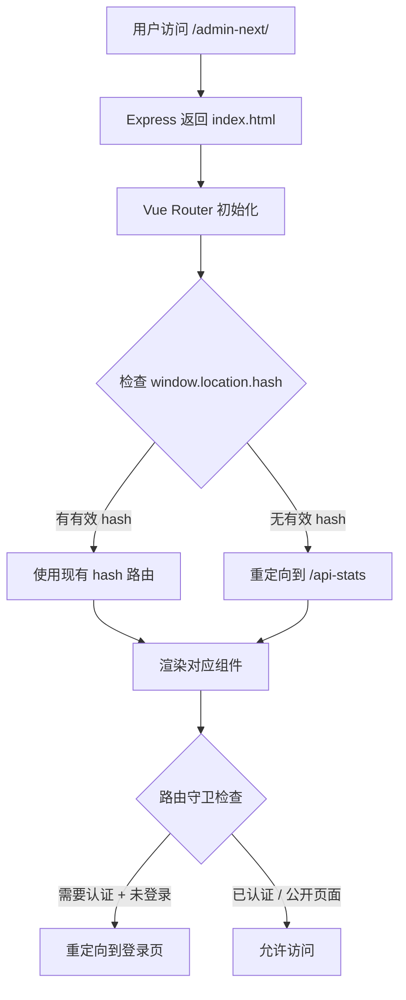
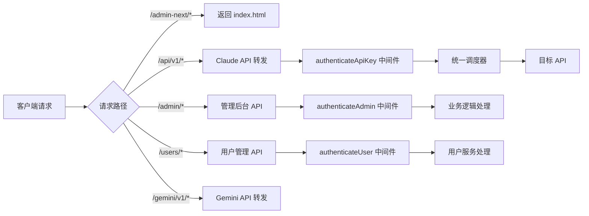

# Claude Relay Service 路由结构详解

> 本文档详细说明了 Claude Relay Service 项目的前后端路由架构、工作原理及配置方式。

## 📋 目录

- [路由架构总览](#路由架构总览)
- [为什么是 `/admin-next/` 路径](#为什么是-admin-next-路径)
- [路由工作流程](#路由工作流程)
- [前端路由详解](#前端路由详解)
- [后端路由详解](#后端路由详解)
- [开发环境 vs 生产环境](#开发环境-vs-生产环境)
- [常见疑问解答](#常见疑问解答)
- [关键配置文件](#关键配置文件)

---

## 🎯 路由架构总览

Claude Relay Service 采用前后端分离架构：

```
┌─────────────────────────────────────────────────────────┐
│                  用户浏览器                              │
│  http://localhost:3000/admin-next/#/api-stats           │
└────────────────────┬────────────────────────────────────┘
                     │
                     ▼
┌─────────────────────────────────────────────────────────┐
│              Express 后端 (Port 3000)                    │
├─────────────────────────────────────────────────────────┤
│  静态文件服务:                                           │
│  • /admin-next/* → Vue SPA (dist/)                      │
│  • /web → 传统 Pug 界面                                  │
├─────────────────────────────────────────────────────────┤
│  API 路由:                                              │
│  • /api/v1/* → Claude API 转发                          │
│  • /admin/* → 管理后台 API                              │
│  • /users/* → 用户管理 API                              │
│  • /gemini/v1/* → Gemini API 转发                       │
│  • /openai/v1/* → OpenAI 兼容转发                       │
│  • /droid/* → Droid (Factory.ai) 转发                  │
│  • /azure/* → Azure OpenAI 转发                         │
└─────────────────────────────────────────────────────────┘
                     │
                     ▼
┌─────────────────────────────────────────────────────────┐
│         Vue 3 SPA (前端路由 - Hash 模式)                 │
├─────────────────────────────────────────────────────────┤
│  Base Path: /admin-next/                                │
│  Router Mode: createWebHistory() + Hash                 │
│                                                          │
│  路由列表:                                               │
│  • #/api-stats → 公开 API 统计                          │
│  • #/login → 管理员登录                                  │
│  • #/user-login → 用户登录                              │
│  • #/dashboard → 管理员仪表板                           │
│  • #/api-keys → API Key 管理                            │
│  • #/accounts → 账户管理                                │
│  • ... 其他路由                                         │
└─────────────────────────────────────────────────────────┘
```

---

## 🎯 为什么是 `/admin-next/` 路径？

### 历史演进

项目存在两套 Web 管理界面：

```
传统界面 (Pug 模板)
  └─ 路径: /web
  └─ 技术: Pug + jQuery
  └─ 状态: 保留兼容

           ↓ 升级

新版 SPA (Vue 3)
  └─ 路径: /admin-next
  └─ 技术: Vue 3 + Vite + Element Plus
  └─ 状态: 当前主力界面
```

### 为什么不直接用 `/admin`？

1. **避免路由冲突**: 后端已存在 `/admin/*` API 路由（100+ 个管理 API 端点）
2. **平滑过渡**: 使用 `-next` 后缀允许新旧界面并存
3. **清晰区分**: 一眼就能区分是 API 端点还是前端界面

---

## 🔄 路由工作流程

### 访问首页的完整流程

```
用户访问: http://localhost:3000/admin-next/
    ↓
┌─────────────────────────────────────────┐
│ 步骤 1: Express 静态文件服务             │
├─────────────────────────────────────────┤
│ app.js:89-104                           │
│ app.get('/admin-next/*', ...)           │
│ → 返回 dist/index.html                  │
└─────────────────────────────────────────┘
    ↓
┌─────────────────────────────────────────┐
│ 步骤 2: Vue Router 初始化                │
├─────────────────────────────────────────┤
│ router/index.js:182-185                 │
│ createWebHistory('/admin-next/')        │
│ → basePath 设置为 /admin-next/          │
└─────────────────────────────────────────┘
    ↓
┌─────────────────────────────────────────┐
│ 步骤 3: 根路径重定向逻辑                 │
├─────────────────────────────────────────┤
│ router/index.js:26-43                   │
│ 检测: window.location.hash              │
│ • 如果 hash 为空或无效                  │
│   → redirect: '/api-stats'              │
│ • 如果 hash 已有路由                    │
│   → 保持现有 hash                       │
└─────────────────────────────────────────┘
    ↓
最终 URL: http://localhost:3000/admin-next/#/api-stats
```

### 为什么会出现 `#/api-stats`？

**三个关键因素：**

1. **Vue Router 使用 History 模式**，但配置了 basePath 为 `/admin-next/`
2. **Express 只处理** `/admin-next/` 本身的请求，返回 `index.html`
3. **根路径 `/` 配置了重定向**，默认跳转到 `/api-stats`

这种设计的优点：
- ✅ 刷新页面不会 404
- ✅ 前端路由完全由 Vue Router 控制
- ✅ 不需要后端配置复杂的 fallback 规则

---

## 📊 前端路由详解

### 路由树结构

```
/admin-next/ (Base Path)
│
├── 公开页面（无需认证）
│   ├── #/api-stats ................. API 统计页面（默认首页）
│   ├── #/login ..................... 管理员登录
│   ├── #/admin-login ............... 重定向到 /login
│   ├── #/user-login ................ 用户登录
│   ├── #/user-register ............. 用户注册
│   ├── #/forgot-password ........... 忘记密码
│   ├── #/reset-password/:token ..... 重置密码
│   └── #/verify-email/:token ....... 邮箱验证
│
├── 用户页面（requiresUserAuth: true）
│   └── #/user-dashboard ............ 用户仪表板
│
└── 管理员页面（requiresAuth: true）
    ├── #/dashboard ................. 管理员仪表板
    ├── #/api-keys .................. API Key 管理
    ├── #/accounts .................. 账户管理（多平台）
    ├── #/tutorial .................. 使用教程
    ├── #/settings .................. 系统设置
    └── #/user-management ........... 用户管理
```

### 路由守卫逻辑

**文件**: `web/admin-spa/src/router/index.js` (lines 187-246)

```javascript
router.beforeEach(async (to, from, next) => {
  // 1. 检查用户认证（requiresUserAuth）
  if (to.meta.requiresUserAuth) {
    if (!userStore.isAuthenticated) {
      return next('/user-login')
    }
  }

  // 2. API Stats 页面无需认证，直接放行
  if (to.path === '/api-stats') {
    return next()
  }

  // 3. 用户登录页面：已登录则重定向到用户仪表板
  if (to.path === '/user-login' && userStore.isAuthenticated) {
    return next('/user-dashboard')
  }

  // 4. 管理员认证检查（requiresAuth）
  if (to.meta.requiresAuth && !authStore.isAuthenticated) {
    return next('/login')
  }

  // 5. 管理员登录页面：已登录则重定向到仪表板
  if (to.path === '/login' && authStore.isAuthenticated) {
    return next('/dashboard')
  }

  next()
})
```

### 关键路由配置示例

#### 1. 根路径重定向（智能处理 Hash）

```javascript
{
  path: '/',
  redirect: () => {
    const hash = window.location.hash

    // 如果 hash 中已经有路由（如密码重置链接）
    if (hash && hash.length > 2 && hash.startsWith('#/') && hash !== '#/') {
      const hashRoute = hash.substring(1)  // 去掉 # 符号
      return hashRoute
    }

    // 否则默认重定向到 api-stats
    return '/api-stats'
  }
}
```

#### 2. 嵌套路由（MainLayout）

```javascript
{
  path: '/dashboard',
  component: MainLayout,
  meta: { requiresAuth: true },
  children: [
    {
      path: '',
      name: 'Dashboard',
      component: DashboardView
    }
  ]
}
```

#### 3. 动态路由参数

```javascript
{
  path: '/reset-password/:token',
  name: 'ResetPassword',
  component: ResetPasswordView,
  meta: { requiresAuth: false }
}
```

---

## 🌐 后端路由详解

### Express 路由结构

**文件**: `src/app.js`

```
Express App (Port 3000)
│
├── 静态资源服务
│   ├── /admin-next/* ............... Vue SPA (生产环境)
│   │   └─ 文件: web/admin-spa/dist/
│   └── /web ........................ 传统 Pug 界面
│       └─ 文件: web/views/
│
├── API 转发路由（多平台支持）
│   ├── /api/v1/* ................... Claude 官方 API
│   │   ├─ POST /api/v1/messages
│   │   ├─ GET /api/v1/models
│   │   └─ GET /api/v1/usage
│   │
│   ├── /claude/v1/* ................ Claude 别名路由
│   │   └─ POST /claude/v1/messages
│   │
│   ├── /gemini/v1/* ................ Gemini API
│   │   ├─ POST /gemini/v1/models/:model:generateContent
│   │   ├─ POST /gemini/v1/models/:model:streamGenerateContent
│   │   └─ GET /gemini/v1/models
│   │
│   ├── /openai/v1/* ................ OpenAI 兼容
│   │   ├─ POST /openai/v1/chat/completions
│   │   ├─ POST /openai/claude/v1/chat/completions
│   │   ├─ POST /openai/gemini/v1/chat/completions
│   │   └─ GET /openai/v1/models
│   │
│   ├── /droid/* .................... Droid (Factory.ai)
│   │   ├─ POST /droid/claude/v1/messages
│   │   └─ POST /droid/openai/v1/chat/completions
│   │
│   ├── /azure/* .................... Azure OpenAI
│   │   └─ POST /azure/...
│   │
│   └── /unified/* .................. 统一调度器
│       └─ POST /unified/v1/messages
│
├── 管理后台 API（100+ 端点）
│   └── /admin/*
│       ├─ POST /admin/login ........ 管理员登录
│       ├─ GET /admin/dashboard ..... 系统概览
│       │
│       ├─ API Key 管理
│       │  ├─ GET /admin/api-keys
│       │  ├─ POST /admin/api-keys
│       │  ├─ PUT /admin/api-keys/:id
│       │  └─ DELETE /admin/api-keys/:id
│       │
│       ├─ Claude 账户管理
│       │  ├─ GET /admin/claude-accounts
│       │  ├─ POST /admin/claude-accounts
│       │  ├─ POST /admin/claude-accounts/generate-auth-url
│       │  ├─ POST /admin/claude-accounts/exchange-code
│       │  └─ DELETE /admin/claude-accounts/:id
│       │
│       ├─ Gemini 账户管理
│       │  ├─ GET /admin/gemini-accounts
│       │  ├─ POST /admin/gemini-accounts
│       │  └─ DELETE /admin/gemini-accounts/:id
│       │
│       ├─ Webhook 配置
│       │  ├─ GET /admin/webhook/configs
│       │  ├─ POST /admin/webhook/configs
│       │  └─ DELETE /admin/webhook/configs/:id
│       │
│       └─ 其他账户类型（Bedrock、Azure、Droid、CCR 等）
│
├── 用户管理 API（24 端点）
│   └── /users/*
│       ├─ 认证相关
│       │  ├─ POST /users/login .............. 用户登录
│       │  ├─ POST /users/login/local ....... 本地认证登录
│       │  ├─ POST /users/login/ldap ........ LDAP 认证登录
│       │  ├─ POST /users/register .......... 用户注册
│       │  └─ POST /users/logout ............ 用户登出
│       │
│       ├─ 密码管理
│       │  ├─ POST /users/change-password
│       │  ├─ POST /users/forgot-password
│       │  ├─ POST /users/reset-password
│       │  └─ POST /users/:userId/reset-password
│       │
│       ├─ 邮箱验证
│       │  ├─ POST /users/verify-email
│       │  └─ POST /users/resend-verification
│       │
│       ├─ API Key 管理
│       │  ├─ GET /users/api-keys
│       │  ├─ POST /users/api-keys
│       │  └─ DELETE /users/api-keys/:keyId
│       │
│       └─ 用户信息
│          ├─ GET /users/profile
│          ├─ GET /users
│          └─ GET /users/:userId/usage-stats
│
└── 系统路由
    ├── /health ..................... 健康检查
    ├── /metrics .................... 系统指标
    ├── /apiStats ................... API 统计数据
    └── / ........................... 根路径重定向
```

### 关键路由代码示例

#### 1. 静态文件服务配置

```javascript
// src/app.js:89-104
const adminSpaPath = path.join(__dirname, '../web/admin-spa/dist')

if (fs.existsSync(adminSpaPath)) {
  // 静态文件服务
  app.use('/admin-next', express.static(adminSpaPath))

  // SPA fallback - 所有 /admin-next/* 都返回 index.html
  app.get('/admin-next/*', (req, res) => {
    res.sendFile(path.join(adminSpaPath, 'index.html'))
  })

  logger.info('✅ Admin SPA (next) static files mounted at /admin-next/')
}
```

#### 2. API 路由挂载

```javascript
// src/app.js
app.use('/api', apiRoutes)              // Claude API 转发
app.use('/claude', apiRoutes)           // Claude 别名
app.use('/gemini', geminiRoutes)        // Gemini API
app.use('/openai', openaiRoutes)        // OpenAI 兼容
app.use('/admin', adminRoutes)          // 管理后台 API
app.use('/users', userRoutes)           // 用户管理 API
app.use('/droid', droidRoutes)          // Droid API
app.use('/azure', azureRoutes)          // Azure OpenAI
```

---

## 🔀 开发环境 vs 生产环境

### 配置对比表

| 特性 | 开发环境 (npm run dev) | 生产环境 (npm start) |
|------|----------------------|---------------------|
| **前端服务器** | Vite Dev Server | Express |
| **前端端口** | 3001 | 3000 (同后端) |
| **Base Path** | `/admin/` | `/admin-next/` |
| **API 前缀** | `/webapi` (代理) | 无前缀（直接请求） |
| **热重载** | ✅ 支持 | ❌ 需重新构建 |
| **访问地址** | http://localhost:3001 | http://localhost:3000/admin-next/ |
| **环境变量** | `VITE_APP_BASE_URL=/admin/` | `VITE_APP_BASE_URL=/admin-next/` |

### 开发环境配置详解

**文件**: `web/admin-spa/vite.config.js`

```javascript
export default defineConfig(({ mode }) => {
  const env = loadEnv(mode, process.cwd(), '')
  const apiTarget = env.VITE_API_TARGET || 'http://localhost:3000'
  const basePath = env.VITE_APP_BASE_URL ||
    (mode === 'development' ? '/admin/' : '/admin-next/')

  return {
    base: basePath,
    server: {
      port: 3001,
      host: true,
      open: true,
      proxy: {
        // 开发环境所有 API 请求都加 /webapi 前缀
        '/webapi': {
          target: apiTarget,
          changeOrigin: true,
          // 转发时去掉 /webapi 前缀
          rewrite: (path) => path.replace(/^\/webapi/, ''),
          configure: (proxy, options) => {
            proxy.on('proxyReq', (proxyReq, req) => {
              console.log('Proxying:', req.method, req.url)
            })
          }
        }
      }
    }
  }
})
```

### API 请求示例

#### 开发环境（Vite Dev Server）

```javascript
// 前端代码
const response = await fetch('/webapi/admin/api-keys')

// Vite 代理处理
// → http://localhost:3000/admin/api-keys
```

#### 生产环境（Express）

```javascript
// 前端代码
const response = await fetch('/admin/api-keys')

// 直接请求（同域名）
// → http://localhost:3000/admin/api-keys
```

---

## ❓ 常见疑问解答

### Q1: 为什么使用 Hash 路由模式（带 `#`）？

**A:** 虽然配置了 `createWebHistory()`，但实际表现为 **History + Hash 混合模式**：

**原因：**
- Vue Router 使用 `createWebHistory('/admin-next/')`
- Express 只配置了 `/admin-next/*` 返回 `index.html`
- Hash 部分（`#/api-stats`）完全由前端 Vue Router 处理

**优点：**
- ✅ 避免与 Express 静态文件路由冲突
- ✅ 刷新页面不会 404
- ✅ 不需要复杂的服务器配置

**如需纯 History 模式（无 hash）：**

需要修改 Express 配置：

```javascript
// 不推荐：需要仔细处理 API 路由优先级
app.get('/admin-next/*', (req, res) => {
  // 所有前端路由都返回 index.html
  res.sendFile(path.join(adminSpaPath, 'index.html'))
})
```

---

### Q2: 为什么有些配置文件路径不一致？

**A:** 发现以下配置差异：

| 配置文件 | 生产环境 Base Path | 状态 |
|---------|-------------------|------|
| `vite.config.js` | `/admin-next/` | ✅ 正确 |
| `router/index.js` | `/admin-next/` | ✅ 正确 |
| `config/app.js` | `/web/admin/` | ⚠️ 历史遗留 |

**说明：**
- `config/app.js` 中的配置是**历史遗留**
- 实际使用的是 Vite 环境变量 `VITE_APP_BASE_URL`，会覆盖 `app.js` 配置
- 没有实际影响，但建议统一以避免混淆

---

### Q3: 前端如何区分开发环境和生产环境？

**A:** 通过环境变量和 API 前缀：

```javascript
// web/admin-spa/src/config/app.js
export const APP_CONFIG = {
  // 开发环境: /admin/
  // 生产环境: /admin-next/
  basePath: import.meta.env.VITE_APP_BASE_URL || '/admin/',

  // 开发环境: /webapi
  // 生产环境: '' (无前缀)
  apiPrefix: import.meta.env.DEV ? '/webapi' : ''
}
```

**使用示例：**

```javascript
import { APP_CONFIG } from '@/config/app'

// 自动适配环境
const url = `${APP_CONFIG.apiPrefix}/admin/api-keys`
```

---

### Q4: 如何添加新的前端路由？

**步骤：**

1. **创建 Vue 组件**（如 `src/views/NewView.vue`）
2. **在 `router/index.js` 中添加路由**：

```javascript
// 1. 懒加载组件
const NewView = () => import('@/views/NewView.vue')

// 2. 添加到 routes 数组
const routes = [
  // ... 现有路由
  {
    path: '/new-feature',
    name: 'NewFeature',
    component: NewView,
    meta: { requiresAuth: true }  // 需要认证
  }
]
```

3. **如需嵌套在 MainLayout 中**：

```javascript
{
  path: '/new-feature',
  component: MainLayout,
  meta: { requiresAuth: true },
  children: [
    {
      path: '',
      name: 'NewFeature',
      component: NewView
    }
  ]
}
```

4. **重新构建前端**：

```bash
npm run build:web
```

---

### Q5: 如何添加新的后端 API 路由？

**步骤：**

1. **在对应路由文件中添加端点**（如 `src/routes/admin.js`）：

```javascript
// GET /admin/new-endpoint
router.get('/new-endpoint', authenticateAdmin, async (req, res) => {
  try {
    // 业务逻辑
    res.json({ success: true, data: {...} })
  } catch (error) {
    res.status(500).json({ error: error.message })
  }
})
```

2. **如需新建路由文件**：

```javascript
// src/routes/newRoutes.js
const express = require('express')
const router = express.Router()

router.get('/test', (req, res) => {
  res.json({ message: 'New route works!' })
})

module.exports = router
```

3. **在 `src/app.js` 中挂载**：

```javascript
const newRoutes = require('./routes/newRoutes')
app.use('/new', newRoutes)
```

---

## 📝 关键配置文件

### 前端配置

| 文件路径 | 作用 | 关键配置项 |
|---------|------|-----------|
| `web/admin-spa/vite.config.js` | Vite 构建配置 | `base`, `server.proxy` |
| `web/admin-spa/src/router/index.js` | Vue Router 路由定义 | `createWebHistory()`, `routes` |
| `web/admin-spa/src/config/app.js` | 应用配置 | `basePath`, `apiPrefix` |
| `web/admin-spa/.env` | 环境变量（开发） | `VITE_APP_BASE_URL` |
| `web/admin-spa/.env.production` | 环境变量（生产） | `VITE_APP_BASE_URL` |

### 后端配置

| 文件路径 | 作用 | 关键配置项 |
|---------|------|-----------|
| `src/app.js` | Express 应用主入口 | 静态文件服务、路由挂载 |
| `src/routes/admin.js` | 管理后台 API | 100+ 管理端点 |
| `src/routes/api.js` | Claude API 转发 | API 转发路由 |
| `src/routes/userRoutes.js` | 用户管理 API | 24 个用户相关端点 |
| `src/routes/geminiRoutes.js` | Gemini API 转发 | Gemini 路由 |
| `src/routes/openaiRoutes.js` | OpenAI 兼容转发 | OpenAI 格式路由 |
| `config/config.js` | 系统配置 | 端口、超时等 |

---

## 🎨 路由关系可视化

### 前端路由流程图



### 后端 API 请求流程



---

## 📚 相关文档

- [邮件服务配置](email-verification-password-reset.md) - 邮箱验证和密码重置功能
- [CLAUDE.md](../CLAUDE.md) - 完整项目架构说明
- [README.md](../README.md) - 项目使用指南

---

## 📅 更新日志

- **2025-11-18**: 创建路由结构文档，详细说明前后端路由架构
- **2025-11-18**: 修复密码重置 URL 重定向问题（router/index.js）

---

**文档维护者**: Claude Code
**最后更新**: 2025-11-18
